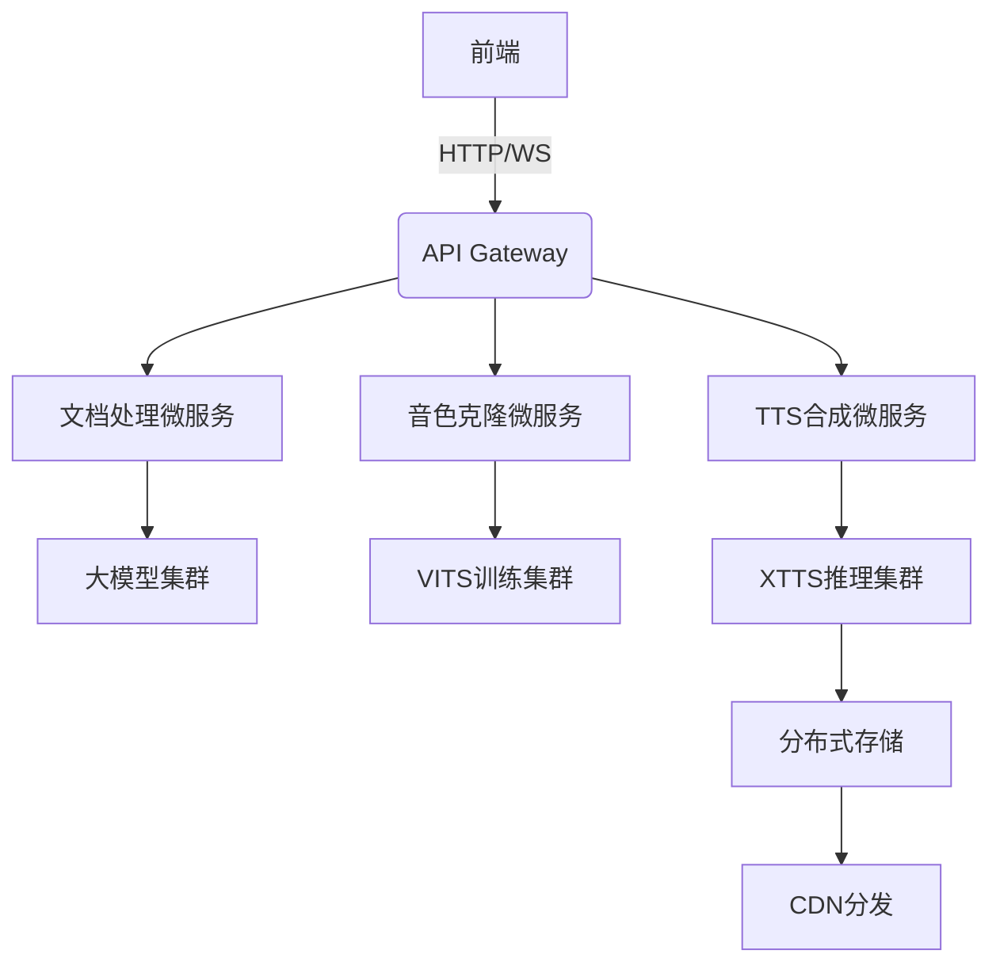
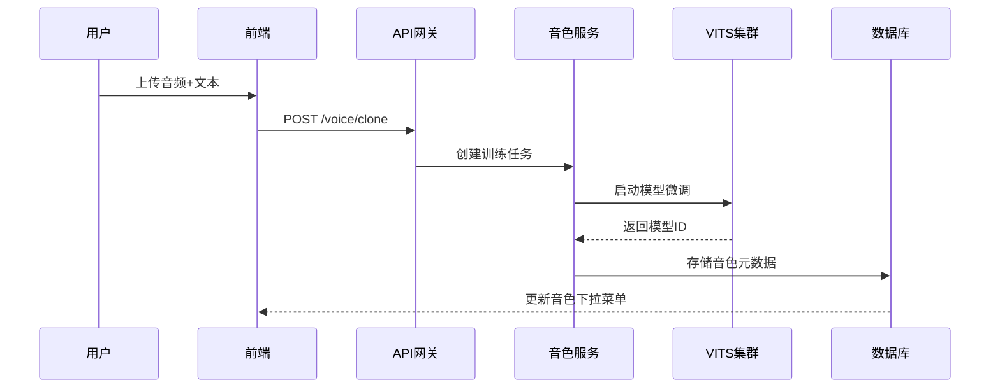
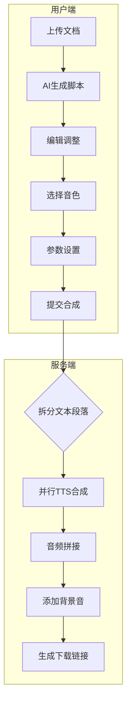

# 播客AI系统

一款基于AI的播客生成系统，可以通过文本对话生成高质量播客音频。本系统支持用户认证，文档处理，语音合成等多种功能。

## 系统架构

- **前端**：React + TypeScript + Ant Design
- **后端**：Node.js + Express + TypeScript
- **数据库**：MySQL（用户认证和数据存储）
- **容器化**：Docker + Nginx

## 功能特点

- 👤 用户认证与权限管理
- 🎙️ 音色选择与自定义
- 📝 对话式脚本编辑
- 🔊 高质量TTS音频合成
- 📦 播客存档与管理
- 🎵 音频播放与下载

## 快速部署

### 使用Docker部署（推荐）

1. 确保已安装Docker和Docker Compose
2. 克隆仓库：`git clone <仓库地址>`
3. 进入项目目录：`cd podcast-ai`
4. 运行部署脚本：`./deploy.sh`
5. 访问应用：`http://localhost`

### 手动部署

#### 前端

```bash
cd client
npm install
npm run build
# 使用Nginx或其他服务器部署build目录
```

#### 后端

```bash
cd server
npm install
npm run build
npm start
```

## 环境变量配置

系统使用环境变量进行配置管理：

### 前端环境变量

- `REACT_APP_API_URL`: 后端API地址
- `REACT_APP_FRONTEND_PORT`: 前端服务端口

### 后端环境变量

- `PORT`: 服务器端口
- `NODE_ENV`: 环境模式
- `DB_HOST`: MySQL数据库主机
- `DB_USER`: MySQL数据库用户名
- `DB_PASSWORD`: MySQL数据库密码
- `DB_NAME`: MySQL数据库名称
- `DB_PORT`: MySQL数据库端口
- `JWT_SECRET`: JWT令牌密钥
- `UPLOAD_DIR`: 上传文件目录
- `GENERATED_DIR`: 生成文件目录
- `STEP_API_KEY`: STEP API密钥
- `TTS_API_ENDPOINT`: TTS API地址

## 用户认证

系统提供完整的用户认证功能：

- **登录**：使用用户名和密码登录系统
- **注册**：创建新用户账号
- **权限控制**：只有登录用户才能访问系统功能
- **离线模式**：当数据库不可用时，系统支持使用默认管理员账户进行离线登录

### 默认管理员账户

- 用户名: `admin`
- 密码: `admin123`

## 文件上传说明

系统支持文档拖拽上传，文件会保存在服务器的`uploads`目录中。在Docker部署模式下，该目录通过卷挂载到主机，确保数据持久化。

## 完整使用流程

1. 登录系统（使用注册的账号或默认管理员账户）
2. 上传文档或创建新对话脚本
3. 使用AI自动生成对话稿或手动编辑
4. 选择/克隆合适的音色
5. s调整语速和情感参数
6. 生成播客音频
7. 在下载中心预览并下载音频文件

## 系统架构图

```
+-----------------+     +------------------+     +------------------+
|                 |     |                  |     |                  |
|  React前端      +---->+  Express后端     +---->+  MySQL数据库     |
|                 |     |                  |     |                  |
+-----------------+     +------------------+     +------------------+
         |                      |
         v                      v
+------------------+     +------------------+
|                  |     |                  |
| 文件存储系统     |     | AI服务(TTS/GPT)  |
|                  |     |                  |
+------------------+     +------------------+
```

## 技术支持

如有问题请联系技术支持团队。

### 开发者指南

#### 启动开发环境

```bash
# 启动后端服务器
cd server
npm run dev

# 启动前端应用
cd client
npm start
```

#### 代码结构

```
podcast-ai/
├── client/                 # 前端代码
│   ├── public/             # 静态资源
│   └── src/                # 源代码
│       ├── components/     # UI组件
│       ├── context/        # 上下文状态
│       ├── pages/          # 页面组件
│       └── services/       # API服务
├── server/                 # 后端代码
│   └── src/                # 源代码
│       ├── config/         # 配置文件
│       ├── controllers/    # 控制器
│       ├── models/         # 数据模型
│       ├── routes/         # API路由
│       └── middleware/     # 中间件
└── db/                     # 数据库相关文件
```

## 贡献指南

欢迎为项目提交PR和Issue，请确保遵循以下原则：

1. 遵循现有的代码风格
2. 添加适当的测试
3. 更新相关文档
4. 遵循Git提交规范

### 播客生成系统 PRD

启动后端服务器（在server目录下运行npm run dev）
启动前端应用（在client目录下运行npm start）

#### **1. 项目概述**
**目标**：构建端到端AI播客生成平台，实现从文档总结、音色克隆到播客合成的全流程自动化  
**用户群体**：内容创作者、自媒体运营者、企业市场部门  
**核心价值**：  
- 文档智能提炼成播客脚本  
- 个性化音色克隆技术  
- 一站式播客生产流水线  


#### **2. 功能需求详述**

##### **2.1 文档处理模块**
| 功能点          | 详细说明                                                                 | 技术指标                      |
|-----------------|--------------------------------------------------------------------------|-------------------------------|
| 文档上传        | 支持PDF/DOCX/TXT格式，限制≤50MB                                         | 文件校验/MIME类型检测          |
| AI总结生成      | 调用GPT-4生成结构化对话稿（主持人A/B交替）                              | 响应时间<15s，token限制4096   |
| 可视化编辑器    | 支持文本增删/角色分配/插入停顿标记[break=1s]                            | 自动保存版本历史               |

##### **2.2 音色克隆模块**
| 功能点          | 详细说明                                                                 | 技术指标                      |
|-----------------|--------------------------------------------------------------------------|-------------------------------|
| 声纹采集        | 5-10s MP3上传+对应文本                                                  | 采样率≥16kHz，信噪比>30dB     |
| 音色训练        | 调用VITS-API训练声学模型                                                | 最大并发训练任务3个/用户      |
| 音色管理        | 展示克隆进度（预估剩余时间），失败自动重试（最多3次）                   | 训练耗时≤15min（GPU加速）     |

##### **2.3 播客合成模块**
| 功能点          | 详细说明                                                                 | 技术指标                      |
|-----------------|--------------------------------------------------------------------------|-------------------------------|
| 多音色选择      | 下拉菜单支持系统预设+用户克隆音色                                       | 实时预览功能（试听10s）       |
| 参数调节        | 语速（0.8x-1.5x）、情感模式（新闻/故事/对话）                           | 动态加载音色参数              |
| 背景音叠加      | 可选环境音效库（咖啡馆/自然声等），音量混合控制                         | 免版税音效库≥100种            |

##### **2.4 下载中心**
| 功能点          | 详细说明                                                                 | 技术指标                      |
|-----------------|--------------------------------------------------------------------------|-------------------------------|
| 任务队列        | 显示合成进度（预估剩余时间），支持暂停/取消                             | 最大并行任务数5个/用户        |
| 文件管理        | 按日期/名称搜索，自动清理30天前文件                                     | 云端存储配额10GB/用户         |
| 多格式导出      | MP3（默认）/WAV格式可选，元数据编辑（作者/封面图）                      | ID3标签支持                   |

---

#### **3. 系统架构设计**


---

#### **4. 技术选型**
**前端框架**  
- 核心框架：React 18 + TypeScript  
- 音频处理：Web Audio API  
- 可视化：D3.js（进度可视化）  

**后端服务**  
- API网关：Kong  
- 任务队列：Celery + RabbitMQ  
- 模型服务：  
  - 文本生成：GPT-4-32K API  
  - 语音克隆：VITS 2.0  
  - TTS合成：XTTS-v2  

**基础设施**  
- 存储：MinIO（对象存储） + PostgreSQL（元数据）  
- 监控：Prometheus + Grafana（资源监控）  
- 安全：JWT鉴权 + 音频水印  

---

#### **5. 关键交互流程**

**音色克隆流程**  


**播客生成流程**  


---

#### **6. 非功能性需求**
**性能要求**  
- 文档处理响应时间：<10s（P95）  
- TTS合成速度：1.2倍实时（RTF=0.8）  
- 系统可用性：99.9%（SLA）  

**安全要求**  
- 音色克隆需生物特征授权（动态数字水印）  
- 敏感词过滤（政治/暴力/色情内容）  
- 训练数据隔离存储（不同用户模型分离）  

**兼容性**  
- 浏览器支持：Chrome 90+/Safari 15+  
- 移动端适配：Pad端完整功能/手机端基础功能  

---

#### **7. 项目里程碑**


#### **8. 风险评估**
**技术风险**  
- 音色克隆相似度不足 → 方案：引入对抗训练提升音色还原度  
- 长文本合成卡顿 → 方案：实现流式分段合成  

**运营风险**  
- 版权争议 → 方案：内置版权检测模块，使用正版音效库  
- 算力成本失控 → 方案：动态配额管理+自动缩容机制  

---

#### **9. 成功指标**
| 指标类型       | 目标值               | 测量方式                     |
|----------------|----------------------|------------------------------|
| 用户活跃       | DAU>5,000           | 数据分析平台                 |
| 内容生产       | 日均生成播客>1,000  | 后台统计系统                 |
| 用户满意度     | NPS>45              | 季度问卷调查                 |
| 商业转化       | 付费率>8%           | 订阅系统数据                 |
